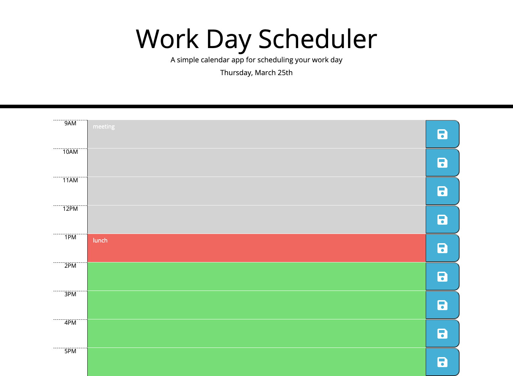

## Description
Schedules events in the work day. Save button saves events in local storage. Color coded according to whether hour block is in past, present, or future.
## Challenges
Took me a while to figure out why the Set Color function wasn't working. Turns out I had to use setInterval to keep it constantly running in order to update the colors.
## Screenshot

## Deployed Application
https://peterw712.github.io/event-scheduler/